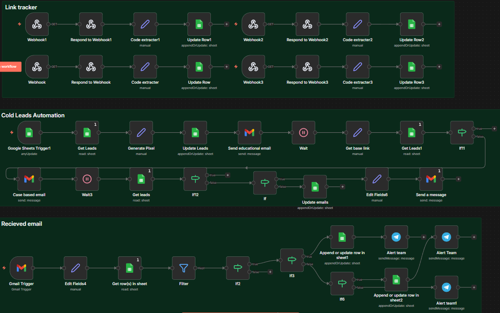
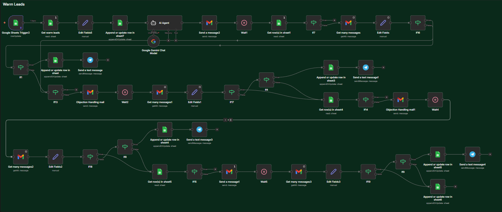
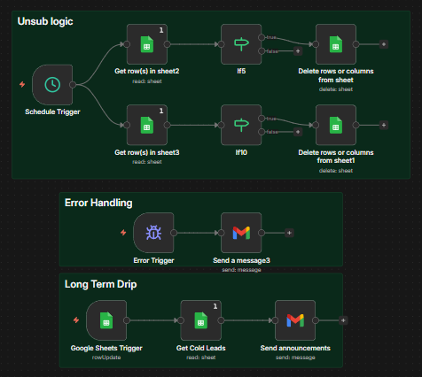

# Lead Nurture + Link Tracking System (n8n)

## 🚩 Goal
The goal was to build a logic based system that could automatically:

- Send educational, case-study and CTA emails to a list of cold and warm leads  
- Objection handling 
- Track which users clicked links 
- Follow up based on engagement  
- Handle unsubscribes  
- Maintain all data inside Google Sheets  

Manually doing this would require tracking clicks, sending follow-ups, and updating spreadsheets by hand.

---

## 🔧 Solution

I built a complete automated outreach and tracking system using n8n that:

1. Pulls leads from Google Sheets  
2. Sends personalized emails  
3. Generates unique tracking links  
4. Detects when a user clicks a link  
5. Updates engagement status  
6. Triggers follow-up emails based on behavior  

Everything runs automatically with no manual work.

---

## 🧩 Features Implemented

- Unique tracking code generation  
- Custom webhook links for each lead  
- Link click tracking  
- Conditional follow-ups  
- Unsubscribe handling  
- Google Sheets as a lightweight CRM  
- Multi-step email drip campaigns  
- Announcement broadcasting  
- AI-generated personalized emails  

---

## 🛠 Tech Used

- n8n  
- Google Sheets API  
- Gmail API  
- Gemini AI
- Webhooks  
- Conditional logic  

---

## 📈 Results

- Fully automated logic based outreach process  
- Ability to track user engagement  
- No manual email sending  
- Data automatically updated  
- Reliable long-term drip system  

---

## 📦 Workflow File

- [View n8n Workflow JSON](../workflows/Lead_Nurture.json)

---

## 📸 Screenshots

---
